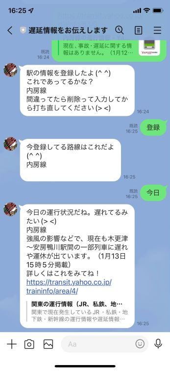
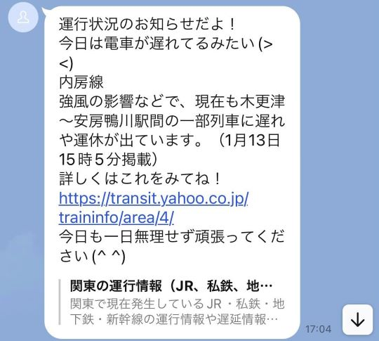
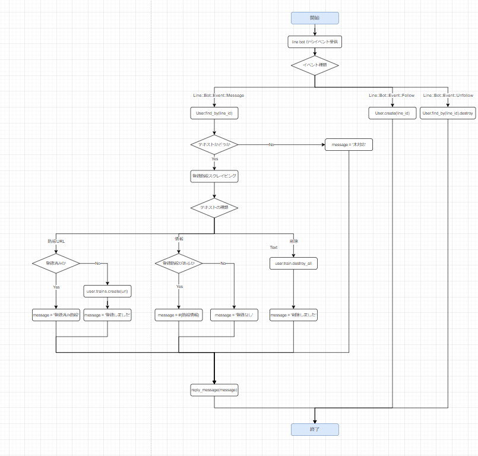
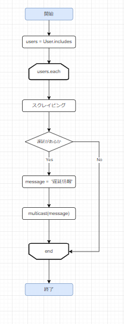
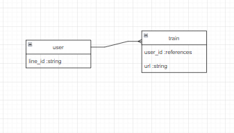

# LineBotTrain

**LineBotTrainは駅の遅延を教えてくれるLineBotです。**

- 朝に登録した路線で遅延があった際にLineで教えてくれます。
- 路線登録後「遅延」と送ると遅延があるか調べてくれます。

  

QR code  
  
※お友達を解除するとLineBotTrainから利用者のデータを削除する仕様にしています。個人情報等気になる方はご利用後お友達解除をお願いいたします。

## このアプリを作った背景

**友人の毎日の煩わしい作業を少しでも楽にできればと思ったからです。** 前職では店舗によって出勤時に遅延があった際、決められた時間までに報告する必要がありました。友人は駅に着いてから遅延を報告すると報告の時間に間に合わないため毎朝路線情報をチェックしていました。煩わしい路線情報のチェックを簡単にできるよう作成いたしました。

## 工夫した点

### 通知方法を何にするかを利用者と話しながら決めた点です。

webアプリにして遅延を調べる仕様にするとチェックするサイトが普段使っているサイトから私が作ったアプリに代わるだけですので本質的な解決にならないと思いました。ですので**友人に朝のルーティンをヒアリングしました。** 朝必ずLineとTwitterは確認するということでしたのでLineBotを作成し、Lineの返信のついでに遅延情報を確認できるようにしました。

#### 朝遅延があった際にこのように通知されます。

## 苦労した点

### 利用開始後の機能変更時の動作確認です。

最初は文言の変更等細かい変更を行う際に友人に連絡して利用停止していました。連絡後、応答先をngrokを利用してアプリを外部公開して動作確認していました。しかし何度も連絡をするのがお互いにとって手間になった点と、友人が職場でほかの人にも紹介して使っていただけるようになってからこの方法が使えなくなりました。そこでテスト用にbotを作成しそこで動作確認をするように切り替えました。

## 設計書

### フローチャート

Response

Batch

### ER図

## 機能一覧

| No | 機能                       | Gem          |
| -- | --                         | --           |
| 1  | スクレイピング             | nokogiri     |
| 2  | Line応答                   | line-bot-api |
| 3  | 定時通知(heroku scheduler) | -            |

## 使用技術

- 言語: Ruby
- フレームワーク: Ruby on Rails
- RDBMS: PostgresSQL
- インフラ: Heroku
- ソースコード管理: GitHub

## 開発環境

- Ruby 2.7.1
- Rails 6.1.4
- PostgresSQL 13.3
